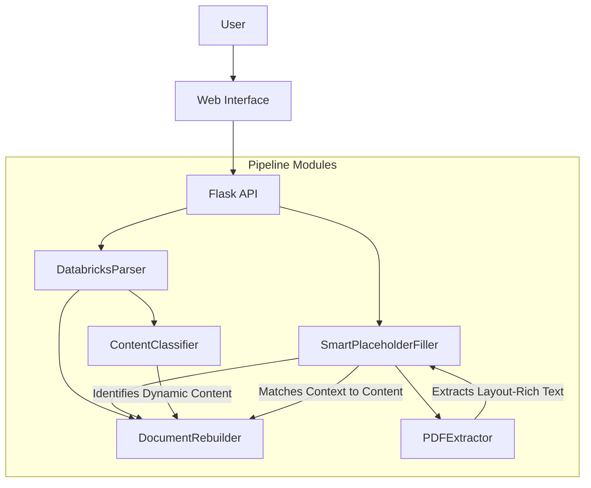

# LayIE-LLM Document Processing Pipeline

This project implements an advanced **Layout-Aware Information Extraction (LayIE)** pipeline for automated document processing. It is based on the design space explored in the paper *"Problem Solved? Information Extraction Design Space for Layout-Rich Documents using LLMs"*.

The system allows you to:
1.  **Create Templates**: Automatically convert raw client documents (reports, letters) into reusable templates with placeholders.
2.  **Smart Fill**: Intelligently fill those templates with content extracted from new source documents (e.g., PDFs), using context-aware LLM reasoning.

## 🚀 Key Features

*   **Layout Preservation**: Uses `pdfplumber` to understand the spatial layout of source documents, ensuring tables and columns are correctly interpreted.
*   **Context-Aware Filling**: Doesn't just "search keywords". It analyzes the *context* around a placeholder (headings, surrounding text) to find the most relevant content in the source PDF.
*   **Zero-Shot Classification**: Uses state-of-the-art LLM prompting (Gemini/GPT) to classify content without needing extensive checking.
*   **High-Fidelity Reconstruction**: Preserves all original formatting, fonts, and styles of the Word document template.

## 🛠️ Architecture

The project consists of a Flask web application and a modular backend pipeline:



## 📦 Installation

1.  **Prerequisites**: Python 3.8+
2.  **Install Dependencies**:
    ```bash
    pip install flask flask-cors python-docx pdfplumber google-genai tiktoken
    ```
3.  **Environment Setup**:
    Create a `.env` file in the `backend` directory with your API keys:
    ```ini
    GOOGLE_API_KEY=your_gemini_key
    DATABRICKS_HOST=...
    DATABRICKS_TOKEN=...
    DATABRICKS_HTTP_PATH=...
    ```

## 📖 How to Use

### 1. Start the Application
Run the Flask server from the `backend` directory:
```bash
cd backend
python app.py
```
The application will start at `http://localhost:5000`.

### 2. Workflow A: Create a Template
*Use this when you have a past report and want to make it reusable.*

1.  Go to the **"Create Template"** tab.
2.  Upload a **DOCX** file (e.g., `Old_Client_Report.docx`).
3.  The system will analyze the document and identify "dynamic" content (names, dates, specific advice).
4.  It will generate a **Template** where these values are replaced with placeholders like `{{CLIENT_NAME}}` or `{{RISK_PROFILE}}`.
5.  Download the generated Template.

### 3. Workflow B: Fill a Template
*Use this when you have a new client's data (PDF) and want to generate a report.*

1.  Go to the **"Fill Template"** tab.
2.  Upload your **Template DOCX** (created in step A).
3.  The system will show you the required placeholders.
4.  Upload the **Source PDF** (e.g., `New_Client_Factfind.pdf`) for the relevant sections.
5.  Click **"Process"**. The system will:
    *   Read the PDF.
    *   Find the best content for each placeholder.
    *   Generate a final, filled DOCX file.

## 📂 Project Structure

*   `backend/app.py`: Main Flask application entry point.
*   `backend/modules/`:
    *   `pdf_extractor.py`: Handles PDF text extraction.
    *   `content_classifier.py`: Identifies dynamic content vs. boilerplate.
    *   `content_chunker.py`: Optimizes text for LLM processing.
    *   `smart_placeholder_filler.py`: The core logic for context-aware content matching.
    *   `document_rebuilder.py`: XML manipulation to modify DOCX files.
